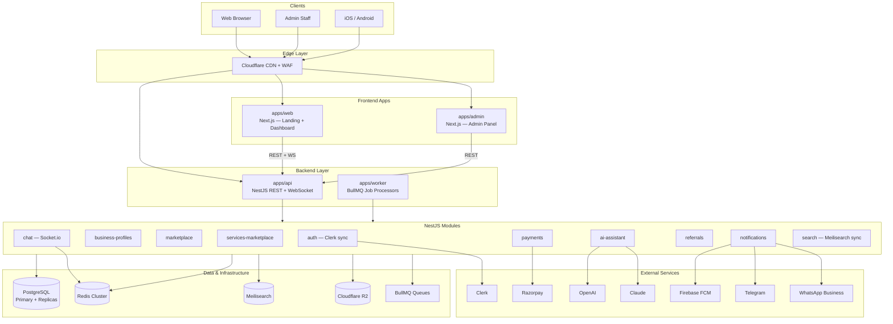

# U&V Platform — Master Architecture

> **Status:** Approved with modifications — awaiting final sign-off before implementation  
> **Vision:** Everything your business needs under one roof — a unified platform for discovery, commerce, services, communication, and growth.  
> **Scale target:** Architecture must support growth to **millions of users** without rewrites.

---

## 1. Executive Summary

U&V is a **multi-sided business platform** connecting businesses, service providers, and customers. It combines a public marketing presence, authenticated workspaces, dual marketplaces (products + services), real-time communication, AI assistance, payments, referrals, multi-channel notifications, and administrative control.

**Approved stack decisions:**

| Area | Decision |
|------|----------|
| Authentication | **Clerk** |
| Backend | **NestJS + PostgreSQL + Prisma** |
| Real-time chat | **Socket.io** (Redis adapter for horizontal scale) |
| AI | **OpenAI + Claude** (Anthropic) |
| Admin | **Separate admin app** (`apps/admin`) |
| Storage | **Cloudflare R2** (+ CDN) |
| Payments | **Razorpay first**, Stripe later (provider abstraction) |
| Search | **Meilisearch** |
| Notifications | **Firebase + Email + Telegram + WhatsApp** |

The backend is a **unified NestJS API** (`apps/api`) serving web, admin, and mobile clients. Domain logic lives in NestJS modules with shared types in `packages/`. No implementation code until final approval.

---

## 2. Architectural Principles

| Principle | Rationale |
|-----------|-----------|
| **API-first backend** | All clients (web, admin, mobile) consume `apps/api` — no business logic in frontends |
| **Modular monolith → extractable services** | NestJS modules with clear boundaries; extract to microservices only when metrics demand it |
| **Scale-ready from day one** | Stateless API, Redis adapter for Socket.io, read replicas, job queues, Meilisearch — no scale rewrites |
| **Provider abstraction** | Payments (Razorpay/Stripe), AI (OpenAI/Claude), notifications (Firebase/Telegram/WhatsApp) behind interfaces |
| **Event-driven async** | Payments, referrals, notifications, AI, and search indexing via BullMQ event bus |
| **Security by layer** | Clerk auth, NestJS guards, RBAC, row-level business scoping, audit logs |
| **Single design system** | `packages/ui` shared across web and admin |
| **Observability everywhere** | OpenTelemetry, structured logs, metrics, tracing on every boundary |

---

## 3. High-Level System Diagram



---

## 4. Repository Structure (Monorepo)

```
uandv-website/
├── apps/
│   ├── web/                          # Module 1 + 3: Landing + Dashboard (Next.js)
│   │   └── app/
│   │       ├── (marketing)/
│   │       ├── (dashboard)/
│   │       └── (auth)/               # Clerk-hosted UI wrappers
│   ├── admin/                        # Module 11: Admin Panel (Next.js, separate deploy)
│   ├── api/                          # Module 12: NestJS unified backend
│   │   └── src/
│   │       ├── modules/              # Domain NestJS modules (mirror packages/modules)
│   │       ├── gateways/             # Socket.io chat gateway
│   │       ├── guards/               # Clerk JWT + RBAC guards
│   │       ├── filters/              # Global exception handling
│   │       └── main.ts
│   └── worker/                       # BullMQ background job processors
│       └── src/
│           ├── processors/           # Notification, search sync, AI, payments
│           └── main.ts
│
├── packages/
│   ├── database/                     # Prisma schema, migrations, seed
│   ├── shared/                     # DTOs, Zod schemas, event types, constants
│   ├── ui/                         # Shared design system (shadcn + Tailwind)
│   └── config/                     # Shared ESLint, TypeScript configs
│
├── docs/
│   ├── architecture/               # Master doc + ADRs
│   ├── api/                          # OpenAPI specs (auto-generated from NestJS)
│   └── modules/                      # Per-module specifications
│
├── infrastructure/
│   ├── docker/                     # Local dev: Postgres, Redis, Meilisearch
│   ├── k8s/                        # Kubernetes manifests (production scale)
│   └── ci/                         # GitHub Actions pipelines
│
├── tools/                          # Scripts, codegen
│
├── app/                            # [LEGACY] Current Next.js app — migrates to apps/web
├── package.json
├── pnpm-workspace.yaml             # (to be added)
└── turbo.json                      # (to be added)
```

**Note:** `apps/mobile-api/` from the initial scaffold is **deprecated** — mobile clients consume `apps/api` at `/v1/*`. The folder will be removed during Phase 0 setup.

Domain logic is implemented as **NestJS modules** inside `apps/api/src/modules/`, not as standalone runtime packages. Shared contracts (DTOs, events, enums) live in `packages/shared/`.

---

## 5. Technology Stack (Approved)

| Layer | Choice | Notes |
|-------|--------|-------|
| **Web / Admin** | Next.js 16 (App Router) | SSR/SSG landing; dashboard calls NestJS API |
| **Backend** | NestJS 11 + TypeScript | REST `/v1/*`, WebSocket gateway, Swagger/OpenAPI |
| **Database** | PostgreSQL 16 | Primary + read replicas at scale |
| **ORM** | Prisma | Schema in `packages/database`, used by api + worker |
| **Auth** | Clerk | Web/admin UI; NestJS validates Clerk JWT; webhooks sync users |
| **Cache / Pub-Sub** | Redis Cluster | Cache, rate limits, Socket.io adapter, BullMQ backend |
| **Job queue** | BullMQ | Notifications, search indexing, AI jobs, webhooks |
| **Real-time** | Socket.io + `@socket.io/redis-adapter` | Horizontally scalable WebSocket |
| **Search** | Meilisearch | Products, services, businesses — synced via worker |
| **Storage** | Cloudflare R2 | Presigned uploads; served via Cloudflare CDN |
| **Payments** | Razorpay (Phase 2) → Stripe (Phase 5+) | Provider interface in payments module |
| **AI** | OpenAI GPT-4o + Claude (Anthropic) | Router selects model per task/tier |
| **Notifications** | Firebase FCM + Email + Telegram + WhatsApp | Multi-channel via notifications module |
| **Email** | Resend or SendGrid | Transactional email channel |
| **Monorepo** | pnpm + Turborepo | Shared packages, parallel builds |
| **Validation** | Zod + class-validator | Shared schemas in `packages/shared` |
| **Testing** | Jest (NestJS) + Vitest + Playwright | Unit, integration, E2E |
| **Observability** | OpenTelemetry + Grafana stack | Traces, metrics, logs |
| **Deployment** | Vercel (web/admin) + Railway/Fly/K8s (api/worker) | Edge CDN via Cloudflare |

---

## 6. Scaling Architecture (Millions of Users)

This section defines how U&V scales without architectural rewrites.

### 6.1 Scaling Tiers

| Tier | Users | Infrastructure |
|------|-------|----------------|
| **Launch** | 0 – 10K | Single API instance, single Postgres, Redis single node, Meilisearch single |
| **Growth** | 10K – 500K | 2–5 API replicas (HPA), Postgres read replica, Redis Sentinel, dedicated worker |
| **Scale** | 500K – 5M | 10–50 API replicas, Postgres primary + 2 replicas, Redis Cluster, Meilisearch cluster, CDN aggressive caching |
| **Hyper-scale** | 5M+ | Extract hot paths to microservices (chat, notifications, search), Kafka event bus, multi-region |

### 6.2 Stateless API Layer

```
                    ┌─────────────┐
                    │  Cloudflare  │  WAF, DDoS, edge rate limits
                    │  Load Balancer│
                    └──────┬──────┘
                           │
              ┌────────────┼────────────┐
              ▼            ▼            ▼
         api-pod-1    api-pod-2    api-pod-N   (NestJS, no local state)
              │            │            │
              └────────────┼────────────┘
                           │
              ┌────────────┼────────────┐
              ▼            ▼            ▼
         Redis Cluster   PostgreSQL   Meilisearch
         (shared state)  (primary)    (search)
```

- All API pods are **identical and stateless**
- Sessions live in Clerk (not server-side)
- Socket.io uses **Redis adapter** so any pod can serve any WebSocket client
- Horizontal Pod Autoscaling on CPU, memory, and request latency

### 6.3 Database Strategy

| Concern | Approach |
|---------|----------|
| **Connection pooling** | PgBouncer in transaction mode (limit connections per pod) |
| **Read scaling** | Read replicas for catalog browse, search fallback, analytics, admin reports |
| **Write scaling** | Partition high-volume tables by time (`messages`, `notification_events`, `audit_logs`) |
| **Hot data** | Redis cache for business profiles, product catalog pages, session-adjacent data |
| **Archival** | Messages > 1 year → cold storage (R2 parquet); audit logs → separate archive DB |
| **Indexing** | Meilisearch owns search indexes; Postgres owns transactional integrity |

**High-volume table partitioning (at Scale tier):**
```
messages          → partitioned by month
notification_events → partitioned by month
audit_logs        → partitioned by month
referral_events   → partitioned by quarter
```

### 6.4 Caching Layers

```
L1: In-process LRU (NestJS, short TTL, hot config/flags)
L2: Redis (business profiles, catalog pages, rate limit counters)
L3: Cloudflare CDN (static assets, public marketing pages, R2 media)
L4: Meilisearch (search results, faceted browse)
```

Cache invalidation via domain events: `product.updated` → invalidate Redis key + Meilisearch reindex job.

### 6.5 Async Processing

All non-latency-critical work goes through **BullMQ** processed by `apps/worker`:

| Queue | Jobs |
|-------|------|
| `notifications` | Push, email, Telegram, WhatsApp delivery |
| `search-sync` | Meilisearch index create/update/delete |
| `payments` | Webhook processing, payout reconciliation |
| `ai` | RAG indexing, long-running AI tasks |
| `referrals` | Commission calculation, fraud checks |
| `media` | Image resize, thumbnail generation |

Worker fleet scales independently of API pods.

### 6.6 Real-Time Chat at Scale

```
Client ──WebSocket──► any api-pod (Socket.io)
                          │
                    Redis Adapter (pub/sub)
                          │
              all api-pods receive fan-out
                          │
                    PostgreSQL (message persistence)
```

- Presence and typing stored in Redis (TTL-based)
- Message writes: persist to Postgres → publish to Redis → fan-out to connected clients
- At hyper-scale: extract chat to dedicated `chat-service` with same Redis adapter pattern

### 6.7 Event Bus Evolution

| Phase | Technology | When |
|-------|-----------|------|
| Launch – Scale | BullMQ (Redis-backed) | < 5M users |
| Hyper-scale | Apache Kafka or NATS JetStream | 5M+ users, need event replay and multi-consumer fan-out |

Event schema is versioned in `packages/shared/events/` regardless of transport.

---

## 7. User Roles & Access Model

```
Platform Roles (stored in PostgreSQL, synced from Clerk metadata)
├── guest           → Landing, public marketplace browse
├── user            → Dashboard, chat, AI, purchases, referrals
├── business_owner  → Business profile, list products/services, receive payments
├── business_staff  → Manage listings, respond to chat (scoped permissions)
├── admin           → Full platform operations via admin panel
└── super_admin     → System config, role assignment, financial overrides
```

**Clerk integration:**
- Clerk handles sign-up, sign-in, OAuth, MFA, session management
- Clerk `publicMetadata` / `privateMetadata` stores platform role
- NestJS `ClerkAuthGuard` validates JWT on every protected route
- Clerk webhooks (`user.created`, `user.updated`, `session.created`) sync to PostgreSQL `users` table
- Admin app uses Clerk with `admin` role requirement

**Authorization layers:**
1. **Clerk JWT** — identity verification
2. **NestJS Guards** — role and permission checks (`@Roles('business_owner')`)
3. **Service layer** — business ownership validation (`business_id` scoping)
4. **Database** — all queries scoped by tenant/user where applicable

---

## 8. Module Specifications

### Module 1 — Landing Website

**Location:** `apps/web/app/(marketing)/`

**Purpose:** Public brand presence and conversion funnel. SEO-optimized, CDN-cached.

**Responsibilities:**
- Marketing pages (home, about, pricing, contact, legal)
- Public marketplace/service browse (data from Meilisearch + NestJS API)
- Public business profile pages
- Clerk sign-up/sign-in CTAs

**Data flow:** Static/ISR pages → NestJS API (public endpoints) → Meilisearch (search) → R2 CDN (media)

**Does NOT own:** Auth sessions, business writes, payments

---

### Module 2 — Authentication (Clerk)

**Location:** Clerk (external) + `apps/api/src/modules/auth/`

**Purpose:** Identity and access management via Clerk, with platform user sync and RBAC in NestJS.

**Responsibilities:**
- Clerk-hosted sign-up, sign-in, OAuth (Google, Apple, etc.)
- MFA (via Clerk)
- JWT issuance and validation
- Webhook sync: Clerk user → PostgreSQL `users` table
- RBAC: roles stored in Clerk metadata + PostgreSQL `user_roles`
- Business membership linking
- Admin role enforcement for `apps/admin`

**NestJS auth module owns:**
- Clerk webhook handler
- User sync service (Clerk ID ↔ internal user ID)
- RBAC guard and decorators
- Internal user profile extensions (not in Clerk)

**Key entities:**
```
User (clerk_id, email, name, avatar, role, created_at)
UserRole, BusinessMembership, AuthAuditLog
```

**Does NOT own:** Business profiles, payment methods

---

### Module 3 — User Dashboard

**Location:** `apps/web/app/(dashboard)/`

**Purpose:** Authenticated workspace — personal overview, business management, module entry points.

**Responsibilities:**
- Dashboard overview (orders, messages, referrals, notifications)
- Business switcher
- Embedded module UIs (chat, AI, marketplace management)
- Notification inbox
- Account settings (delegates profile updates to Clerk + API)

**Communicates with:** NestJS API exclusively (REST + Socket.io client)

---

### Module 4 — Business Profiles

**Location:** `apps/api/src/modules/business-profiles/`

**Purpose:** Canonical business identity — registration, profile, verification, team.

**Responsibilities:**
- Business onboarding wizard
- Profile CRUD (name, slug, logo, cover, description, categories, location)
- Logo/cover uploads → R2 presigned URLs
- Verification workflow (pending → admin approved)
- Team invites and role assignment
- Public profile API + Meilisearch indexing

**Key entities:** `Business`, `BusinessCategory`, `BusinessLocation`, `BusinessVerification`, `BusinessMember`, `BusinessSettings`

**Events:** `business.created`, `business.updated`, `business.verified`

---

### Module 5 — Marketplace (Products)

**Location:** `apps/api/src/modules/marketplace/`

**Purpose:** E-commerce for physical and digital products.

**Responsibilities:**
- Product CRUD with variants, images (R2), inventory
- Meilisearch indexing on create/update/delete
- Cart and checkout (handoff to payments/Razorpay)
- Order lifecycle: placed → paid → fulfilled → completed → refunded
- Reviews and ratings

**Key entities:** `Product`, `ProductVariant`, `ProductImage`, `Category`, `Cart`, `CartItem`, `Order`, `OrderItem`, `ProductReview`

**Events:** `order.placed`, `order.paid`, `order.fulfilled`, `product.updated`

---

### Module 6 — Services Marketplace

**Location:** `apps/api/src/modules/services-marketplace/`

**Purpose:** Services marketplace — consulting, appointments, gigs, project work.

**Responsibilities:**
- Service listing CRUD with packages and pricing models
- Availability calendar and booking slots
- Booking lifecycle with milestone deliverables
- Escrow-style payment holds (via Razorpay)
- Meilisearch indexing
- Dispute initiation

**Key entities:** `Service`, `ServicePackage`, `ServiceAvailability`, `Booking`, `BookingMilestone`, `ServiceReview`

**Events:** `booking.requested`, `booking.accepted`, `booking.completed`

---

### Module 7 — Chat System (Socket.io)

**Location:** `apps/api/src/modules/chat/` + `apps/api/src/gateways/chat.gateway.ts`

**Purpose:** Real-time messaging at scale via Socket.io with Redis adapter.

**Responsibilities:**
- 1:1 and group conversations
- Context-linked threads (order, booking, business inquiry)
- Message types: text, image, file (R2 attachments)
- Read receipts, typing indicators, presence (Redis TTL)
- Message persistence (PostgreSQL, partitioned at scale)
- Moderation flags → admin queue
- Triggers notification jobs on new messages

**Real-time flow:**
```
Client ──WebSocket──► ChatGateway (Socket.io)
                         │
                   Redis Adapter ◄──► all API pods
                         │
                   PostgreSQL (messages)
                         │
                   BullMQ → notifications queue
```

**Key entities:** `Conversation`, `ConversationParticipant`, `Message`, `MessageAttachment`, `ReadReceipt`, `ChatReport`

---

### Module 8 — AI Assistant (OpenAI + Claude)

**Location:** `apps/api/src/modules/ai-assistant/`

**Purpose:** Intelligent copilot with dual-model support.

**Responsibilities:**
- Conversational AI (REST streaming + WebSocket)
- Model router: OpenAI for speed/cost, Claude for reasoning/long context
- RAG over platform docs, business FAQs, listing data
- Tools: draft listings, suggest pricing, summarize chats
- Token usage tracking and plan-tier rate limits
- Admin-managed prompts and knowledge base
- Long-running AI jobs via BullMQ worker

**Model selection logic:**
| Task | Model | Reason |
|------|-------|--------|
| Quick FAQ, autocomplete | OpenAI GPT-4o-mini | Low latency, low cost |
| Listing generation, analysis | OpenAI GPT-4o | Quality + speed balance |
| Complex reasoning, long docs | Claude Sonnet | Superior context window |
| Sensitive moderation | Claude | Safety alignment |

**Key entities:** `AIConversation`, `AIMessage`, `AIKnowledgeDocument`, `AIPromptTemplate`, `AIUsageLog`

---

### Module 9 — Payments (Razorpay → Stripe)

**Location:** `apps/api/src/modules/payments/`

**Purpose:** All money movement with provider abstraction for Razorpay now, Stripe later.

**Responsibilities:**
- **Phase 2:** Razorpay integration (India-first)
  - One-time product checkout
  - Service booking payments
  - Platform subscription billing
  - Webhook processing
- **Phase 5+:** Stripe Connect for international marketplace splits and seller payouts
- Provider interface: `PaymentProvider` abstract class
  ```
  PaymentProvider
  ├── RazorpayProvider   (Phase 2 — active)
  └── StripeProvider     (Phase 5+ — international)
  ```
- Refunds, invoices, financial reporting for admin
- Idempotent webhook handling via BullMQ

**Key entities:** `PaymentAccount`, `PaymentIntent`, `Transaction`, `Payout`, `Subscription`, `Invoice`, `Refund`, `PlatformFee`

**Event flow:**
```
OrderPlaced → payments.createOrder → Razorpay → webhook → BullMQ → OrderPaid → notifications
```

---

### Module 10 — Referral System

**Location:** `apps/api/src/modules/referrals/`

**Purpose:** Growth engine — trackable links, attribution, commissions, fraud detection.

**Responsibilities:**
- Unique referral codes and shareable links
- Attribution on signup (Clerk webhook), first purchase, first listing
- Commission rules engine (admin-configurable campaigns)
- Referral dashboard
- Fraud detection (self-referral, duplicate accounts)
- Commission payout via payments module

**Key entities:** `ReferralCode`, `ReferralLink`, `ReferralEvent`, `ReferralCampaign`, `ReferralCommission`, `ReferralPayout`, `ReferralFraudFlag`

---

### Module 11 — Admin Panel (Separate App)

**Location:** `apps/admin/` (separate Next.js deployment)

**Purpose:** Internal operations console — isolated from public web for security.

**Responsibilities:**
- User and business management (via NestJS admin API)
- Business verification queue
- Marketplace and services moderation
- Chat report queue
- Financial dashboard (Razorpay transactions, GMV, refunds)
- Referral campaign management
- AI knowledge base and prompt editor
- Notification template management
- Platform settings and feature flags
- Analytics dashboards
- Full audit log viewer

**Security:**
- Separate domain (`admin.uandv.com`)
- Clerk auth with `admin` / `super_admin` role required
- All actions audit-logged to `audit_logs` table
- IP allowlist option (Cloudflare Access)
- No shared cookies with public web

---

### Module 12 — API Layer (NestJS — Web + Mobile)

**Location:** `apps/api/`

**Purpose:** Unified backend serving web dashboard, admin panel, and mobile apps.

**Responsibilities:**
- Versioned REST API (`/v1/*`)
- Socket.io WebSocket gateway (chat, AI streaming)
- OpenAPI 3.1 spec (auto-generated via `@nestjs/swagger`)
- Clerk JWT validation on all protected routes
- Rate limiting (Redis-backed, per-user and per-IP)
- Request validation (class-validator + Zod)
- Idempotency key support on mutating endpoints
- Presigned R2 upload URL generation
- Health checks and readiness probes (K8s)

**Endpoint groups:**
```
/v1/users/*           Profile, settings, devices
/v1/businesses/*      CRUD, team, public profile
/v1/products/*        Browse, search, cart, orders
/v1/services/*        Browse, book, manage bookings
/v1/chat/*            Conversations, messages (REST history)
/v1/ai/*              Assistant chat (SSE stream)
/v1/payments/*        Checkout, history, subscriptions
/v1/referrals/*       Code, stats, share links
/v1/notifications/*   Preferences, inbox, device tokens
/v1/search/*          Unified Meilisearch query
/v1/admin/*           Admin-only operations (role-guarded)
/ws                   Socket.io (chat, typing, presence)
/health               Liveness probe
/ready                Readiness probe (DB + Redis + Meilisearch)
```

**API standards:**
- Pagination: cursor-based (`?cursor=`, `?limit=`)
- Errors: `{ "statusCode", "error", "message", "details" }`
- Auth: `Authorization: Bearer <clerk_jwt>`
- Idempotency: `Idempotency-Key` header on POST/PATCH/DELETE

---

### Cross-Cutting — Notifications System

**Location:** `apps/api/src/modules/notifications/` + `apps/worker/src/processors/notifications/`

**Purpose:** Multi-channel notification delivery for all platform events.

**Channels (approved):**

| Channel | Provider | Use cases |
|---------|----------|-----------|
| **Push (mobile)** | Firebase Cloud Messaging | Order updates, chat messages, booking reminders |
| **Email** | Resend / SendGrid | Verification, receipts, weekly digests, referral earnings |
| **Telegram** | Telegram Bot API | Real-time alerts, admin alerts, opt-in user notifications |
| **WhatsApp** | WhatsApp Business API | Order confirmations, booking reminders, support (opt-in) |

**Architecture:**
```
Domain event → BullMQ notifications queue → NotificationProcessor
                                                    │
                                    ┌───────────────┼───────────────┐
                                    ▼               ▼               ▼
                              Firebase FCM      Email          Telegram
                                    │               │               │
                                    └───────────────┼───────────────┘
                                                    ▼
                                              WhatsApp (opt-in)
```

**Responsibilities:**
- User notification preferences (per-channel opt-in/out)
- Device token registration (FCM)
- Template engine (admin-configurable templates per event type)
- Delivery tracking and retry logic
- Rate limiting per channel per user
- Notification inbox (in-app, stored in PostgreSQL)

**Key entities:** `NotificationPreference`, `NotificationTemplate`, `NotificationEvent`, `DeviceToken`, `NotificationInbox`

---

### Cross-Cutting — Search (Meilisearch)

**Location:** `apps/api/src/modules/search/` + `apps/worker/src/processors/search-sync/`

**Purpose:** Fast, faceted search across products, services, and businesses.

**Indexes:**
| Index | Source module | Searchable fields |
|-------|--------------|-------------------|
| `products` | marketplace | title, description, category, price, business name |
| `services` | services-marketplace | title, description, category, price, location |
| `businesses` | business-profiles | name, description, category, location |

**Sync:** Domain events (`product.updated`, `business.updated`, etc.) → BullMQ → worker reindexes affected documents.

---

## 9. Cross-Module Event Bus

BullMQ queues (Redis-backed), evolving to Kafka at hyper-scale:

| Event | Publisher | Subscribers |
|-------|-----------|-------------|
| `user.registered` | auth (Clerk webhook) | referrals, notifications, admin |
| `business.created` | business-profiles | admin, search-sync, notifications |
| `business.verified` | admin | business-profiles, notifications |
| `product.updated` | marketplace | search-sync, cache-invalidate |
| `order.placed` | marketplace | payments, chat, referrals, notifications |
| `order.paid` | payments | marketplace, notifications |
| `booking.completed` | services-marketplace | payments, referrals, notifications |
| `payment.succeeded` | payments | marketplace, services, referrals, notifications |
| `referral.converted` | referrals | payments, notifications |
| `message.created` | chat | notifications |
| `message.reported` | chat | admin, notifications |
| `ai.usage` | ai-assistant | payments (metering), admin |

---

## 10. Data Architecture

**PostgreSQL** (primary + read replicas):

```
users, user_roles              ← synced from Clerk
businesses, business_members, business_verifications
products, product_variants, orders, order_items, carts
services, service_packages, bookings, booking_milestones
conversations, messages, message_attachments
ai_conversations, ai_messages, ai_knowledge_documents
payment_accounts, transactions, payouts, subscriptions, invoices
referral_codes, referral_events, referral_commissions
notification_preferences, notification_events, device_tokens
audit_logs, feature_flags
```

**Redis Cluster namespaces:**
```
cache:*              Application cache
ratelimit:*          API rate limiting
chat:presence:*      Online status, typing indicators
socket.io#*          Socket.io Redis adapter
bull:*               BullMQ job queues
session:temp:*       Short-lived tokens (presigned URL nonces)
```

**Meilisearch indexes:** `products`, `services`, `businesses`

**Cloudflare R2 buckets:**
```
uandv-media/         Business logos, product images, chat attachments
uandv-documents/     Invoices, contracts, verification documents
uandv-archives/      Cold storage for old messages and audit logs
```

---

## 11. Security Architecture

| Concern | Approach |
|---------|----------|
| **Authentication** | Clerk (web/admin/mobile JWT) |
| **Authorization** | NestJS Guards + RBAC decorators + business_id scoping |
| **API security** | Cloudflare WAF, Redis rate limits, CORS allowlist, input validation |
| **Payments** | PCI minimized — Razorpay/Stripe hosted checkout, no raw card storage |
| **File uploads** | R2 presigned URLs, MIME validation, size limits, virus scan (Phase 3) |
| **Admin isolation** | Separate app, separate domain, Clerk admin role, audit log |
| **Secrets** | Environment variables / K8s secrets; never in repo |
| **Data privacy** | PII in Clerk + PostgreSQL; GDPR delete via Clerk + cascade |

---

## 12. Deployment Architecture

```
┌──────────────────────────────────────────────────────────────────┐
│                     Cloudflare (CDN + WAF + R2)                   │
├─────────────────┬────────────────────┬───────────────────────────┤
│  apps/web       │  apps/admin        │  api.uandv.com            │
│  (Vercel)       │  (Vercel)          │  apps/api (Railway/K8s)   │
│  uandv.com      │  admin.uandv.com   │  + apps/worker            │
├─────────────────┴────────────────────┴───────────────────────────┤
│  PostgreSQL (Neon/Supabase)   Redis (Upstash/Elasticache)       │
│  Meilisearch Cloud            Cloudflare R2                     │
├──────────────────────────────────────────────────────────────────┤
│  Clerk   Razorpay   OpenAI   Claude   Firebase   Telegram   WA  │
└──────────────────────────────────────────────────────────────────┘
```

---

## 13. Phased Delivery Roadmap

### Phase 0 — Foundation (Week 1–2)
- [ ] Monorepo setup (pnpm, Turborepo)
- [ ] NestJS API scaffold + health checks
- [ ] Prisma schema + PostgreSQL + Docker Compose
- [ ] Clerk integration (web + API JWT validation + webhooks)
- [ ] Migrate landing page to `apps/web`
- [ ] Redis + BullMQ worker scaffold

### Phase 1 — Core Platform (Week 3–6)
- [ ] Business profiles + R2 uploads + onboarding
- [ ] User dashboard shell
- [ ] Admin panel shell (separate app) + Clerk admin role
- [ ] Meilisearch setup + search-sync worker
- [ ] Notifications module (email channel first)

### Phase 2 — Commerce (Week 7–10)
- [ ] Product marketplace (CRUD, browse, cart)
- [ ] Razorpay checkout + webhooks
- [ ] Order management + email notifications
- [ ] Firebase push notifications

### Phase 3 — Services & Communication (Week 11–14)
- [ ] Services marketplace + booking flow
- [ ] Socket.io chat (web + mobile)
- [ ] Telegram + WhatsApp notification channels
- [ ] Chat-triggered push notifications

### Phase 4 — Growth & Intelligence (Week 15–18)
- [ ] Referral system + campaigns
- [ ] AI assistant (OpenAI + Claude, streaming)
- [ ] Admin analytics, moderation, audit log

### Phase 5 — Scale & International (Week 19+)
- [ ] Read replicas, connection pooling, table partitioning
- [ ] Stripe Connect (international payments)
- [ ] Multi-region deployment path
- [ ] Native mobile apps (iOS/Android consuming `/v1/*`)
- [ ] Advanced fraud detection, performance optimization

---

## 14. Approved Decisions (Locked)

| # | Decision | Approved choice |
|---|----------|----------------|
| 1 | Authentication | **Clerk** |
| 2 | Backend | **NestJS + PostgreSQL + Prisma** |
| 3 | Real-time chat | **Socket.io + Redis adapter** |
| 4 | AI | **OpenAI + Claude** |
| 5 | Admin | **Separate admin app** |
| 6 | Storage | **Cloudflare R2** |
| 7 | Payments | **Razorpay first, Stripe later** |
| 8 | Search | **Meilisearch** |
| 9 | Notifications | **Firebase + Email + Telegram + WhatsApp** |
| 10 | Scale target | **Millions of users** |
| 11 | Monorepo | **pnpm + Turborepo** |
| 12 | Multi-tenancy | **Shared DB + business_id scoping** |

---

## 15. Final Approval Checklist

Before any code is written, please confirm:

- [ ] Updated module boundaries and NestJS structure are correct
- [ ] Scaling architecture (Section 6) meets your expectations
- [ ] Razorpay-first payment strategy is acceptable
- [ ] Notifications channels and phasing are correct
- [ ] Phased roadmap priority matches your business goals
- [ ] Ready to begin Phase 0 implementation

**Reply with final approval — implementation begins only after your sign-off.**
